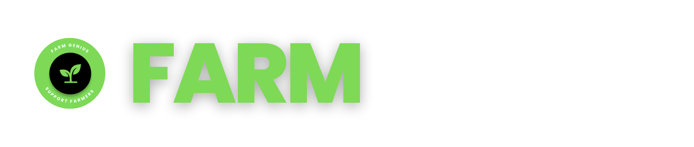

# Capstone C23-PS094

## Project Description

By establishing Farm Genius as a capstone project, the team aims to provide practical, scalable solutions that can empower farmers with smart insights and support them in making decisions about crop selection and disease management. This project aims to contribute to the progress of the agricultural industry in Indonesia, increase the income and welfare of farmers, and promote sustainable agricultural practices through the adoption of AI technology.

## Super Team

| **Name**                   | **Bangkit ID**  |  **Learning Path** |
| -------------------------- | --------------- | ------------------ |
| Iman Nurohman              | **M309DSX0276** | Machine Learning   |
| Reyhan Agus Priyatna       | **M309DSX2361** | Machine Learning   |
| Hedrin S. Sitorus          | **M030DSX2134** | Machine Learning   |
| Riyandi Firman Pratama     | **A309DSX1139** | Mobile Development |
| Rolasta J.A. Sitorus       | **C030DSX2885** | Cloud Computing    |
| Husada M. Karunia Hutasoit | **C345DKX4096** | Cloud Computing    |
